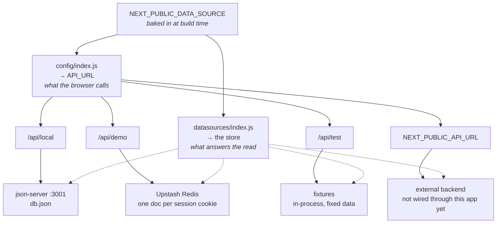

# Deployment

How this app is deployed and how the demo/preview deployments work. For the
design rationale behind the data-source selector and the serverless rules that
shaped it, see [`AGENTS.md`](../AGENTS.md). Local setup lives in the
[README](../README.md).

## Deploying a preview without a database

The app has no database service: it persists through `json-server` and a local
`db.json`. To run a preview deployment (Vercel or any other host) where no
`json-server` process exists, two fallbacks kick in automatically.

**One switch picks the backend.** `NEXT_PUBLIC_DATA_SOURCE` (see
`config/dataSource.js`) is the only thing that decides which backend a
deployment talks to, and both halves derive from it — the URL the browser calls
(`config/index.js`) and the storage behind it (`datasources/index.js`), so the
two can never disagree:



| `NEXT_PUBLIC_DATA_SOURCE` | browser calls | storage |
| --- | --- | --- |
| `api` | `NEXT_PUBLIC_API_URL` (required) | the real backend — **not wired through this app yet** |
| `json-server` | `/api/local` | `json-server` at `JSON_SERVER_URL` |
| `memory` | `/api/demo` | Upstash Redis, per browser session |
| `fixtures` | `/api/test` | committed arrays, per process (integration tests) |

**Switching between them:**

- Already wired per environment — `yarn dev` uses `json-server`,
  `yarn test:integration` uses `fixtures`, and a deployment uses `memory`.
- One-off, locally: `NEXT_PUBLIC_DATA_SOURCE=memory yarn build && yarn start`.
- On Vercel: set it in the dashboard, **then redeploy**.

That last step is not optional. `NEXT_PUBLIC_*` values are compiled into the
bundle, so changing one without rebuilding does nothing — and a bundle built
for one namespace calling another is exactly what the 400 above catches.

The `api` row is the one gap: that backend lives in its own repository and
nothing here talks to it yet, so selecting it fails with a clear error rather
than quietly serving demo data.

The API routes live under a dynamic `pages/api/[source]/` segment, so one set
of files serves every namespace and the path itself names the backend. A
request to the wrong namespace gets a 400 rather than silently reading the
wrong store.

**Redis-backed database.** With `NEXT_PUBLIC_DATA_SOURCE=memory`,
`datasources/index.js` routes every read and write to `datasources/memory/`, a
store that emulates the `json-server` REST and query subset the app uses on top of
[Upstash Redis](https://upstash.com) (free tier). It is seeded from
`db.seed.json` on first use and scoped per browser session through the
`cero_demo_session` cookie, so people opening the same preview URL do not
share or overwrite each other's data. Each session key expires after 24h of
inactivity (`SESSION_TTL_SECONDS` in `datasources/memory/store.js`), so
storage doesn't grow unbounded on the free tier.

This is not a plain in-memory store: Vercel deploys every file under
`pages/api/**` (and every page with `getServerSideProps`) as its own separate
serverless function, so a module-level `Map` would not be shared across
routes — writes made through one endpoint would be invisible to another. A
real external store (reachable by every function over HTTPS) is required for
consistent state, which is what Upstash's REST-based Redis client provides
with no connection pooling concerns in a serverless environment.

To set it up on Vercel: Project → Storage → Marketplace Database Providers →
Upstash, and create (or connect) a Redis store — this injects the connection
env vars automatically. `datasources/memory/client.js` reads
`UPSTASH_REDIS_REST_URL`/`UPSTASH_REDIS_REST_TOKEN`, falling back to
`KV_REST_API_URL`/`KV_REST_API_TOKEN` (the older Vercel KV naming) in case the
integration exposes those instead. **Never put real credentials in
`.env.production`** — that file is committed to the repo. Configure them only
through Vercel's dashboard (scoped to whichever environment you're testing:
Preview and/or Production), or in a local `.env.local` (gitignored) for local
reproduction. The free tier caps out at 10k commands/day and 256MB, which is
plenty for demo/testing traffic but worth knowing about.

**Demo authentication.** When `NEXT_PUBLIC_DEMO_MODE` is `true`,
`features/common/auth.js` replaces the Auth0 `withPageAuthRequired` and `useUser`
with stubs, so no Auth0 secret or per deployment callback URL is needed. Anyone
with the URL gets in, so keep the deployment private if that matters.

Environment variables to configure on the project:

| Variable | Value |
| --- | --- |
| `NEXT_PUBLIC_DEMO_MODE` | `true` |
| `NEXT_PUBLIC_DATA_SOURCE` | `memory` (already the value in `.env.production`) |
| `NEXT_PUBLIC_MAXIMUM_IN_PRIORITY_TASKS` | `2` |
| `NEXT_PUBLIC_MAXIMUM_BACKLOG_QUANTITY` | `4` |
| `NEXT_PUBLIC_API_URL` | leave unset, it is only read when the source is `api` |
| `JSON_SERVER_URL` | leave unset, it is only read when the source is `json-server` |
| `UPSTASH_REDIS_REST_URL` / `UPSTASH_REDIS_REST_TOKEN` | from the Upstash store connected above |

Vercel deployment protection can stay enabled. `getServerSideProps` reads
storage directly through `features/*/queries.js` rather than making an HTTP
request to this same deployment's API routes, so there is no internal request
for protection to reject. (It used to make that round trip, and because the
request carried no auth it came back as `401: Protected deployment`, failing
every server rendered page.) The API routes reuse the same functions, so the
two paths cannot drift apart.

To reproduce a preview locally, create a free Upstash Redis database, put its
REST URL/token in a gitignored `.env.local`, then:

```
NEXT_PUBLIC_DEMO_MODE=true yarn build
NEXT_PUBLIC_DEMO_MODE=true yarn start
```

Since `next start` runs as a single warm process, this only verifies the
Redis-backed logic itself, not the cross-function consistency it exists for —
that only shows up on an actual Vercel deployment, which is where this should
ultimately be exercised. `datasources/memory/*.test.js` covers the query/CRUD
logic against a mocked Redis client without needing real credentials.

Local development is unaffected: `.env.development` selects `json-server`, so
`yarn dev` keeps using `json-server` and `db.json`, and never touches Redis.

The integration suite (`yarn test:integration`) selects `fixtures`, so it runs
against the same routes with the committed arrays in `datasources/fixtures/`
behind them — no `json-server`, no Redis, and your local `db.json` is left
alone. It waits for the server to be listening and exits when TestCafe does.

