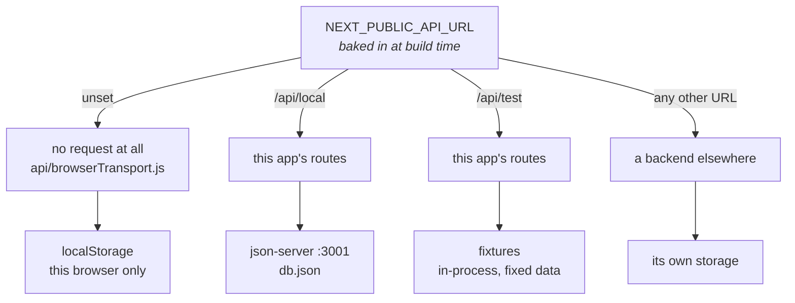

# Deployment

How this app is deployed and how the demo/preview deployments work. For the
design rationale behind the data-source selector and the serverless rules that
shaped it, see [`AGENTS.md`](../AGENTS.md). Local setup lives in the
[README](../README.md).

## Deploying a preview without a database

The app has no database service: it persists through `json-server` and a local
`db.json`. To run a preview deployment (Vercel or any other host) where no
`json-server` process exists, two fallbacks kick in automatically: the data
moves into each visitor's browser, and Auth0 is stubbed.

**One switch picks the backend: `NEXT_PUBLIC_API_URL`.** The frontend calls
that API, and with none configured it falls back to the visitor's browser.
`config/dataSource.js` derives everything else from it — where the browser's
requests go (`config/index.js`, `api/index.js`) and the storage behind them
(`datasources/index.js`) — so the two can never disagree:


```mermaid
flowchart TD
  ENV["NEXT_PUBLIC_API_URL<br/><i>baked in at build time</i>"]

  ENV -->|unset| INBROWSER["no request at all<br/>api/browserTransport.js"]
  ENV -->|/api/local| LOCAL["this app's routes"]
  ENV -->|/api/test| TEST["this app's routes"]
  ENV -->|any other URL| EXT["a backend elsewhere"]

  INBROWSER --> LS["localStorage<br/>this browser only"]
  LOCAL --> JS["json-server :3001<br/>db.json"]
  TEST --> FIX["fixtures<br/>in-process, fixed data"]
  EXT --> BACKEND["its own storage"]
```

| `NEXT_PUBLIC_API_URL` | browser calls | storage | server rendering |
| --- | --- | --- | --- |
| unset | nothing — answered in the browser | `localStorage`, per browser | skipped, the page loads its data |
| `/api/local` | this app's routes | `json-server` at `JSON_SERVER_URL` | reads the store directly |
| `/api/test` | this app's routes | committed arrays, per process (integration tests) | reads the store directly |
| any other URL | that backend | its own | skipped, the page loads its data |

**Switching between them:**

- Already wired per environment — `yarn dev` uses `/api/local`,
  `yarn test:integration` uses `/api/test`, and a deployment leaves it unset.
- One-off, locally: `NEXT_PUBLIC_API_URL=/api/local yarn build && yarn start`.
- On Vercel: set it in the dashboard (or delete it for localStorage), **then
  redeploy**.

That last step is not optional. `NEXT_PUBLIC_*` values are compiled into the
bundle, so changing one without rebuilding does nothing — and a bundle built
for one namespace calling another is exactly what the 400 below catches.

**A backend elsewhere** has to implement the same REST contract as this app's
routes (`tasks/:id/complete`, `focus-sessions/finish`, `focus-sessions/active`,
…) and allow CORS from the app's origin. That is also why the URL can't point
straight at `json-server`: it only has plain CRUD, and the rules live in this
app's routes and `features/*/commands.js`.

The API routes live under a dynamic `pages/api/[source]/` segment, so one set
of files serves every namespace and the path itself names the backend. A
request to the wrong namespace gets a 400 rather than silently reading the
wrong store, and a deployment whose API URL isn't one of them (unset, or a
backend elsewhere) answers 404 on all of them.

**Browser-backed demo.** With no `NEXT_PUBLIC_API_URL`, no request leaves the
browser. `api/index.js` hands the HTTP client
`api/browserTransport.js` instead of `fetch`, which routes each request to the
same `features/*/commands.js` the API routes run, and those reach
`datasources/localStorage/` through `datasources/index.js`. The data is one JSON
document under the `cero:collections` key, seeded from `db.seed.json` on first
use. So the demo behaves exactly like the routes do, with nothing to provision:
no database, no credentials, no quota.

What that means in practice:

- **Per browser.** Each visitor — each browser profile — has their own data,
  and it never reaches the server.
- **No expiry.** Data stays until the site's data is cleared. DevTools (the cog,
  enabled on demo deployments) has **Reset demo data**, which restores the seed
  and reloads `/planning`.
- **No server-rendered data.** `getServerSideProps` has nothing to read, so it
  returns empty props; the page loads its data once it is in the browser, and
  the planning ↔ focus-session redirect happens there too
  (`useFocusSessionRedirect`).
- **Two tabs, last write wins.** Writes are queued per tab, so two tabs writing
  at the same moment can lose one. The next write corrects it.

**Migrating from `NEXT_PUBLIC_DATA_SOURCE`.** That variable used to pick the
backend (with `memory` keeping the demo in Upstash Redis). It is retired: a
deployment that still sets it fails its build with a message pointing at
`NEXT_PUBLIC_API_URL`. Delete it from the dashboard — and set
`NEXT_PUBLIC_API_URL` only if the deployment has a real backend — then
redeploy. The Upstash integration and its `UPSTASH_REDIS_REST_*` /
`KV_REST_API_*` variables can be removed too.

**Demo authentication.** When `NEXT_PUBLIC_DEMO_MODE` is `true`,
`features/common/auth.js` replaces the Auth0 `withPageAuthRequired` and `useUser`
with stubs, so no Auth0 secret or per deployment callback URL is needed. Anyone
with the URL gets in, so keep the deployment private if that matters.

Environment variables to configure on the project:

| Variable | Value |
| --- | --- |
| `NEXT_PUBLIC_DEMO_MODE` | `true` |
| `NEXT_PUBLIC_MAXIMUM_IN_PRIORITY_TASKS` | `2` |
| `NEXT_PUBLIC_MAXIMUM_BACKLOG_QUANTITY` | `4` |
| `NEXT_PUBLIC_API_URL` | leave unset for the localStorage demo, or a backend's URL |
| `JSON_SERVER_URL` | leave unset, it is only read behind `/api/local` |

Vercel deployment protection can stay enabled. With the browser store or a
backend elsewhere the server reads nothing at all; for the sources it does read, `getServerSideProps` goes
directly through `features/*/queries.js` rather than making an HTTP request to
this same deployment's API routes, so there is no internal request for
protection to reject. (It used to make that round trip, and because the
request carried no auth it came back as `401: Protected deployment`, failing
every server rendered page.) The API routes reuse the same functions, so the
two paths cannot drift apart.

To reproduce a preview locally — exactly, since everything happens in the
browser:

```
NEXT_PUBLIC_DEMO_MODE=true yarn build
NEXT_PUBLIC_DEMO_MODE=true yarn start
```

Local development is unaffected: `.env.development` selects `json-server`, so
`yarn dev` keeps using `json-server` and `db.json`, and never touches
`localStorage`.

The integration suite (`yarn test:integration`) selects `fixtures`, so it runs
against the same routes with the committed arrays in `datasources/fixtures/`
behind them — no `json-server`, and your local `db.json` is left alone. It waits for the server to be listening and exits when TestCafe does.

